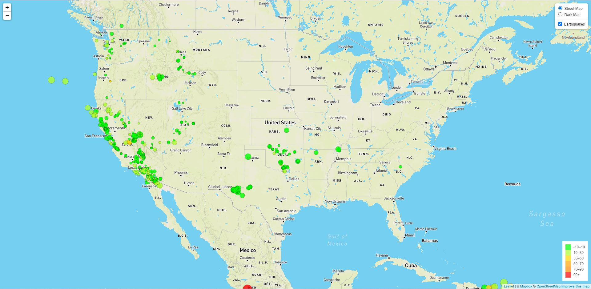
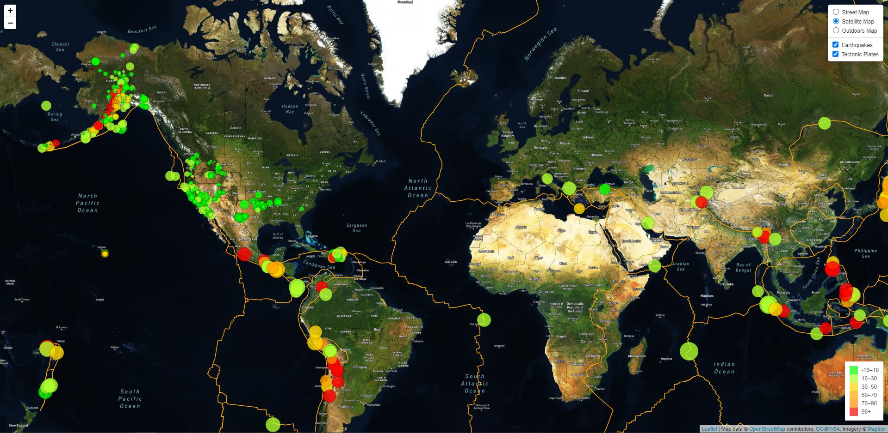

# Leaflet Challenge

## Level 1 - Basic Visualization 
Displays a leaflet map that shows earthquake locations from the last 7 days.

## Level 2 - More Data
Displays a leaflet map that includes earthquake locations from the last 7 days along with locations of the world's tectonic plates.

